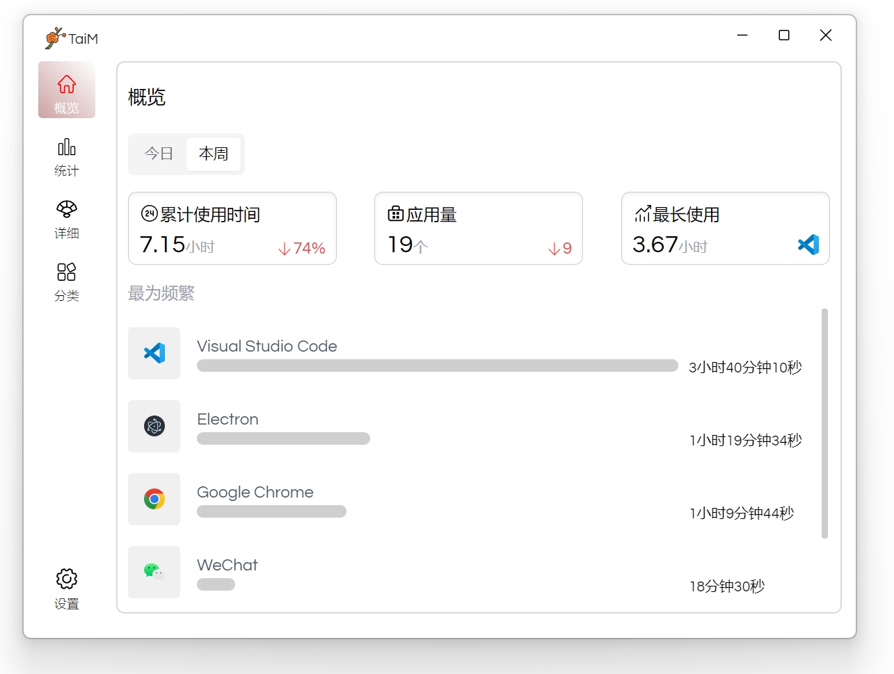

> [!WARNING]
> 目前还是开发阶段，只支持windows，功能还在完善中，欢迎提交issue。

## TaiM！

`windows` 的时间统计软件，记录和统计你每天使用软件的时间，帮助你更好的管理时间。

## 功能

- [x]  统计软件使用时间
- [x] 睡眠模式，五分钟与窗口不交互不进行统计
- [ ] 导出/导入统计结果
- [ ] 主题切换/随着系统自动切换
- [ ] 开机自启动
- [ ] 设置统计时间范围
- [ ] 自定义分类
- [ ] 自定义忽略软件
- [ ] 监控网站使用时间
- [ ] 优化内存开销（最主要的）
- [ ] 多语言
- [ ] 添加流畅动画

## 安装

> 正在开发中。。。

## 开发
 需要 `Node 18+` ，`C++` 和 `python 2.7` 环境
 > 可以安装 Visual Studio Code，并安装 `C++` 模块 或者 全局安装 windows-build-tools

 - pnpm i
 - pnpm rebuild
 - pnpm dev

 所有的数据都保存在本地，使用的`better-sqlite3`

 前端框架使用了`Vue3`、`Vite5`、`Tailwindcss`、`shadcn/vue`

 ## 鸣谢
 页面UI和逻辑的想法来源于 ---  [Tai](https://github.com/Planshit/Tai)

 监测当前活动页面使用的插件 --- [get-windows](https://github.com/sindresorhus/get-windows)

## 贡献
欢迎提交PR，或者提交issue。
