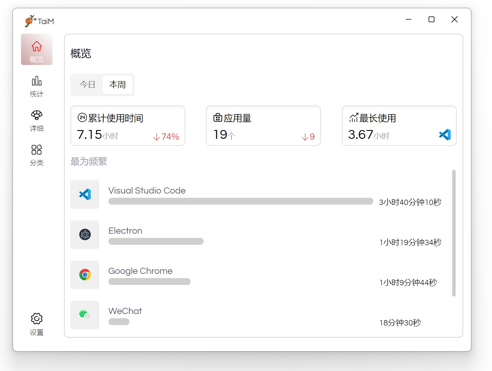

## TaiM！

跨平台的软件时间统计软件，目前只支持Windows。

## 功能

- [x]  统计软件使用时间
- [ ] 导出/导入统计结果
- [ ] 主题切换/随着系统自动切换
- [ ] 开机自启动
- [ ] 设置统计时间范围
- [ ] 自定义分类
- [ ] 自定义忽略软件
- [ ] 睡眠模式，长时间不使用不进行统计

## 安装

- Windows：下载Windows版本，解压后运行TaiM.exe即可
- macOS：下载macOS版本，解压后运行TaiM.app即可
- Linux：下载Linux版本，解压后运行TaiM.sh即可

## 开发
 需要 `Node 18+` ，`C++` 和 `python 2.7` 环境
 > 可以安装 Visual Studio Code，并安装 `C++` 模块 或者 全局安装 windows-build-tools

 - pnpm i
 - pnpm rebuild
 - pnpm dev

 所有的数据都保存在本地，使用的`better-sqlite3`

 前端框架使用了`Vue3`、`Vite5`、`Tailwindcss`、`shadcn/vue`

## 贡献
欢迎提交PR，或者提交issue。
